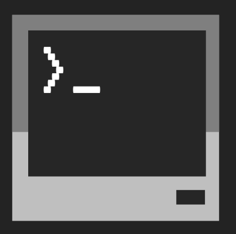

<p align="center">
  
</p>

# ComputerCraftDrafts
](https://img.shields.io/github/workflow/status/NonlinearFruit/ComputerCraftDrafts/test?label=tests)

These are some foundational turtle scripts that have been organically growing. The addition of a test runner (`busted`) for ComputerCraft allows for TDD and production quality software.

| Scripts      | Description |
| ---          | ---         |
| automaton    |             |
| builder      |             |
| lumberjack   |             |
| mazegenerator|             |
| miner        |             |
| mover        |             |
| placer       |             |
| tunnel       |             |

| Resources                                   |
|---                                          |
| [Minecraft: Java Edition][minecraft]        |
| [Feed the Beast Modpacks][ftb]              |
| [ComputerCraft][cc]                         |
| [ComputerCraft Vim][vimcc]                  |
| [ComputerCraft Github][github]              |
| [ComputerCraft Emulator (desktop)][copycat] |
| [ComputerCraft Emulator (web)][ccemux]      |

# How to install on a ComputerCraft computer or turtle

```
pastebin run p8PJVxC4                           -- Install github tool
pastebin run Q45Vadaw                           -- Install vim
github clone NonlinearFruit/ComputerCraftDrafts -- Install this repo
mv ComputerCraftDrafts/* .                      -- Move scripts to home directory
rm ComputerCraftDrafts                          -- Remove the old folder
rm *_*.lua                                      -- Remove tests (specs and fakes)
rm busted.lua                                   -- Remove test runner
```

[minecraft]: https://www.minecraft.net/en-us/store/minecraft-java-edition
[ftb]: https://www.feed-the-beast.com
[cc]: https://github.com/SquidDev-CC/CC-Tweaked
[vimcc]: https://github.com/HugoNikanor/VimCC
[ccemux]: https://emux.cc
[copycat]: https://github.com/SquidDev-CC/copy-cat
[github]: https://github.com/eric-wieser/computercraft-github
